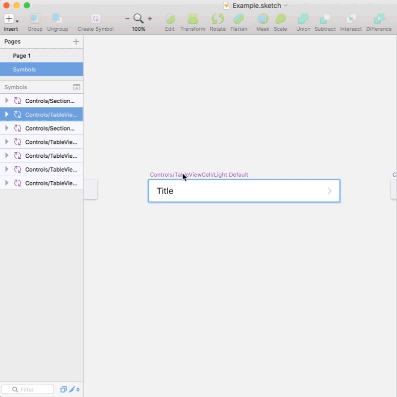

# sketch-select-same-symbols
This is a Sketch plugin that selects same symbols as the currently selected symbol.

## Installation

1. [Download the plugin](https://github.com/yusukesaitoh/sketch-select-same-symbols/archive/master.zip)
2. Double-click the file, 'SelectSameSymbols.sketchplugin'

## Usage

- <kbd>shift</kbd> + <kbd>ctrl</kbd> + <kbd>s</kbd> - Select Same Symbols On The Current Page
- <kbd>shift</kbd> + <kbd>ctrl</kbd> + <kbd>alt</kbd> + <kbd>s</kbd> - Select Same Symbols On All Pages
